# 数据库结构与查法

> 唯一真源是 `prisma/schema.prisma`（模型、枚举、关系、索引都写在那里）。
> 本文回答的是"**我该用哪种方式去看它**"以及"**看什么**"。

---

## 1. 四种查法（按使用频率排序）

### ① 服务器上直接进 psql（最常用、零暴露）

```bash
docker exec -it zigoai-db psql -U zigoai -d zigoai
```

进去之后最常用的几条：

```sql
\dt                                  -- 列出所有表
\d "AiSuggestion"                    -- 看某张表的字段、类型、索引、外键
\d+ "Customer"                       -- 连注释与存储参数一起看
\di                                  -- 只看索引
\df                                  -- 只看函数
select * from "_prisma_migrations" order by finished_at;   -- 迁移历史
\q                                   -- 退出
```

> 一句话就查完的写法（不进入交互）：
> ```bash
> docker exec zigoai-db psql -U zigoai -d zigoai -c '\d "Customer"'
> ```

### ② 图形化工具（DBeaver / Navicat / pgAdmin）

数据库端口只绑在宿主机回环 `127.0.0.1:15432`，所以**必须先建 SSH 隧道**，再连本机端口：

```bash
ssh -L 15432:127.0.0.1:15432 root@42.194.164.30
# 隧道保持开着，然后在图形工具里连 127.0.0.1:15432
# 库 zigoai / 用户 zigoai / 密码见服务器 /opt/zigoai/.env 里的 DATABASE_URL
```

连上之后左侧树里就能展开表、看结构、看数据、导 ER 图。**做演示时最直观**。

### ③ Prisma Studio（带图形界面的数据浏览器）

在本机跑（用本地开发库）：

```bash
pnpm exec prisma studio     # 打开 http://localhost:5555
```

它读 `.env` 里的 `DATABASE_URL`。想连线上，先把 `.env` 的 `DATABASE_URL` 指向
隧道端口（`127.0.0.1:15432`），看完记得改回来。

### ④ 只看结构、不连库

直接读 `prisma/schema.prisma` —— 它是**唯一真源**，数据库里的表就是由它生成的。
`prisma/migrations/*/migration.sql` 则是每一次结构变更的实际 SQL。

---

## 2. 表关系（7 张业务表 + 1 张迁移表）

```
Tenant（企业）
 ├─ User（账号：SALES / MANAGER）
 └─ Customer（客户：负责人 assigneeId → User）
     ├─ Message（聊天记录：CUSTOMER / SALES，带 batchId 与幂等键）
     ├─ CustomerState（客户状态：阶段 / 意图 / 需人工 / 版本号，1:1）
     ├─ AiSuggestion（AI 判断 + 调用审计，含原始请求响应与链路）
     └─ FollowUpTask（跟进任务：幂等键 attempt）
```

删除策略：`Tenant` / `Customer` 上都是 `onDelete: Cascade` —— 删企业会带走账号与客户，
删客户会带走它的消息、状态、建议、跟进任务。**这正是"重置演示数据"能一把清干净的原因**。

## 3. 每张表在业务里负责什么

| 表 | 职责 | 关键字段 |
|---|---|---|
| `Tenant` | 企业档案 + **企业规则** | `slug`（唯一，种子按它 upsert）、`rules`(Json)、`forbidden`(Json)、`handoff`(Json：交接触发器/敏感词/金额阈值) |
| `User` | 账号与角色 | `email`（唯一）、`passwordHash`（scrypt）、`role`（SALES/MANAGER） |
| `Customer` | 客户档案 | `handle`（微信号）、`assigneeId`（销售归属，**销售只能看自己的**） |
| `Message` | 聊天记录 | `role`、`content`、`clientMessageId`（**幂等键**）、`batchId`（连续消息合并） |
| `CustomerState` | **客户状态（事实）** | `leadStage`、`intent`、`needHuman`、`lastCustomerMessageAt`、`followUpCount`、`version`（乐观锁） |
| `AiSuggestion` | **AI 判断 + 调用审计** | 六个输出字段 + `rulesApplied`、`stateAdjustments`、`handoffNotes`、`ruleViolation`、`rawRequest/rawResponse`、`pipelineTrace`、token/耗时/成本、`sentMessageId/finalReply/sentAt` |
| `FollowUpTask` | 跟进任务 | `attempt`（幂等键，单调递增）、`status`、`dueAt` |
| `_prisma_migrations` | 迁移历史 | Prisma 自己维护 |

**一句话记住两张核心表的区别**：`AiSuggestion` 是"**AI 说了什么**"（可回放、可审计），
`CustomerState` 是"**事实是什么**"（状态机裁决后的结果）。两者分开是这个项目最核心的设计。

## 4. 索引与唯一约束（从真实数据库读出来的）

```
Tenant          Tenant_slug_key                              UNIQUE (slug)
User            User_email_key                               UNIQUE (email)
Customer        Customer_tenantId_assigneeId_idx             (tenantId, assigneeId)
Customer        Customer_tenantId_updatedAt_idx              (tenantId, updatedAt)
Message         Message_tenantId_clientMessageId_key         UNIQUE (tenantId, clientMessageId)   ← 消息幂等
Message         Message_tenantId_customerId_createdAt_idx    (tenantId, customerId, createdAt)
CustomerState   CustomerState_customerId_key                 UNIQUE (customerId)                  ← 一客户一状态
CustomerState   CustomerState_tenantId_leadStage_idx         (tenantId, leadStage)
CustomerState   CustomerState_tenantId_lastCustomerMessageAt_idx (tenantId, lastCustomerMessageAt) ← 跟进扫描
AiSuggestion    AiSuggestion_tenantId_customerId_createdAt_idx   (tenantId, customerId, createdAt)
AiSuggestion    AiSuggestion_tenantId_status_createdAt_idx       (tenantId, status, createdAt)
FollowUpTask    FollowUpTask_tenantId_customerId_attempt_key UNIQUE (tenantId, customerId, attempt) ← 跟进幂等
FollowUpTask    FollowUpTask_tenantId_status_dueAt_idx       (tenantId, status, dueAt)
```

**规律**：所有索引都以 `tenantId` 打头 —— 多租户隔离不只是查询条件，索引也是按租户分片友好的。

## 5. 排查时最常用的几条查询

```sql
-- 客户漏斗一览
select c.name, cs."leadStage", cs.intent, cs."needHuman", cs.version
from "CustomerState" cs join "Customer" c on c.id = cs."customerId"
order by cs."leadStage";

-- 最近 20 次 AI 调用（看状态、耗时、token、失败原因）
select "createdAt", "customerIntent", "leadStage", status, model, "latencyMs",
       "promptTokens" + "completionTokens" as tokens, "errorMessage"
from "AiSuggestion" order by "createdAt" desc limit 20;

-- 某条判断的完整链路（分段耗时 + 原始请求响应）
select "pipelineTrace", "rawRequest", "rawResponse"
from "AiSuggestion" where id = '<suggestion-id>';

-- 有没有"同一个批次产生了两条建议"（并发保护是否漏了）
select "batchId", count(*) from "AiSuggestion"
where "batchId" is not null group by "batchId" having count(*) > 1;

-- 有没有"有消息但没判断"的客户（补跑机制的触发条件）
select c.name, count(m.id) as customer_messages
from "Message" m join "Customer" c on c.id = m."customerId"
where m.role = 'CUSTOMER'
group by c.id, c.name
having count(m.id) > 0
   and not exists (select 1 from "AiSuggestion" s where s."customerId" = c.id);
```

## 6. ER 图（Mermaid，GitHub 上可直接渲染）

> 不需要连数据库 —— 这份图与 `schema.prisma` 同源。
> 为了可读性只列**关键字段**，完整定义（类型、默认值、注释）以 `schema.prisma` 为准。

```mermaid
erDiagram
    Tenant ||--o{ User : "拥有账号"
    Tenant ||--o{ Customer : "拥有客户"
    Tenant ||--o{ Message : "隔离字段"
    Tenant ||--o{ AiSuggestion : "隔离字段"
    Tenant ||--o{ FollowUpTask : "隔离字段"
    User ||--o{ Customer : "作为负责人"
    User ||--o{ Message : "作为发送人"
    Customer ||--|| CustomerState : "1:1 当前状态"
    Customer ||--o{ Message : "聊天记录"
    Customer ||--o{ AiSuggestion : "历次判断"
    Customer ||--o{ FollowUpTask : "跟进任务"

    Tenant {
        string id PK
        string slug UK "种子按它 upsert"
        string name
        string salesGoal
        string tone
        json rules "企业规则（可带 guard 规则码）"
        json forbidden "明文禁止项"
        json handoff "交接触发器 / 敏感词 / 金额阈值"
    }

    User {
        string id PK
        string tenantId FK
        string email UK
        string name
        string passwordHash "scrypt"
        string role "SALES | MANAGER"
    }

    Customer {
        string id PK
        string tenantId FK
        string handle "微信号"
        string name
        string phone
        string source
        string assigneeId FK "销售归属：SALES 只能看自己的"
    }

    Message {
        string id PK
        string tenantId FK
        string customerId FK
        string role "CUSTOMER | SALES"
        string content
        string senderUserId FK "SALES 消息才有"
        string batchId "连续消息合并"
        string clientMessageId "幂等键"
    }

    CustomerState {
        string id PK
        string customerId UK "一客户一状态"
        string leadStage "NEW→DISCOVERY→INTERESTED→HIGH_INTENT→WON/LOST"
        string intent
        bool needHuman "只升不降，只能人工解除"
        string humanReason
        datetime lastCustomerMessageAt "跟进扫描依据"
        int followUpCount "客户回话时归零"
        int version "乐观锁"
    }

    AiSuggestion {
        string id PK
        string tenantId FK
        string customerId FK
        string batchId "一批次一次判断"
        string customerIntent "六个必需输出字段之一"
        string leadStage
        string nextAction
        string reply "建议回复"
        string reason "判断依据"
        bool needHuman
        json rulesApplied "模型自述引用了哪几条规则"
        json stateAdjustments "系统改写了什么"
        json handoffNotes "为什么升级人工"
        string ruleViolation "规则守护发现的违规"
        string status "SUCCESS | RETRY_OK | FALLBACK | ERROR"
        string trigger "NEW_MESSAGE | REGENERATE | FOLLOW_UP | INITIAL_BACKFILL"
        json rawRequest "送进模型的原文（可回放）"
        json rawResponse "模型原始输出"
        json pipelineTrace "分段耗时 + 每步输入输出"
        int latencyMs "模型真实耗时（响应体读完才计时）"
        int promptTokens
        int completionTokens
        string sentMessageId FK "销售实际发出的消息"
        string finalReply "与 reply 不同即说明人工改过"
    }

    FollowUpTask {
        string id PK
        string tenantId FK
        string customerId FK
        int attempt "幂等键（单调递增）"
        string status "PENDING | SENT | SKIPPED | CANCELLED"
        datetime dueAt
        string reason
        string suggestionId FK "生成出来的跟进建议"
    }
```



## 7. 枚举取值（评审常会问到的）

| 枚举 | 取值 | 说明 |
|---|---|---|
| `Role` | `SALES` / `MANAGER` | 销售只能看自己名下客户；主管可看全企业并改规则 |
| `MessageRole` | `CUSTOMER` / `SALES` | 一轮判断里只有 CUSTOMER 消息进入新消息列表，销售消息进历史 |
| `LeadStage` | `NEW` → `DISCOVERY` → `INTERESTED` → `HIGH_INTENT` → `WON` / `LOST` | **顺序化**的，所以"只能前进不能回退"能写成代码而不是靠模型自觉；后两个是终态，只能人工确认 |
| `SuggestionStatus` | `SUCCESS` / `RETRY_OK` / `FALLBACK` / `ERROR` | 描述**这次调用本身的健康度**，不是"判断对不对" |
| `FollowUpStatus` | `PENDING` / `SENT` / `SKIPPED` / `CANCELLED` | 跟进任务状态 |
| `customer_intent`（字符串枚举，非 DB enum） | 了解产品 / 询价 / 预约 / 犹豫 / 投诉 / 购买 / 售后 / **拒绝** / 其他 | 定义在 `src/lib/types.ts`；`拒绝` 是 M12 补的（客户明确表示不继续） |
| `human_reason` | 客户投诉 / 客户明确要求真人 / AI 无法确认答案 / 高价值成交信号 / 触发租户规则红线 / AI 输出异常降级 / **客户流失倾向** / **成交待确认** / 其他 | 决定销售看到的第一句话，也决定 `REASON_TO_TRIGGER` 映射到哪个企业可关的触发器 |

> 为什么这些枚举放在代码里而不是数据库 enum：它们要**同时**出现在 prompt 示例、zod 校验和
> TypeScript 类型里（一份 schema 三处复用）。放进 DB enum 反而会让"改一个取值"变成一次迁移。

## 8. 一个已知缺口（主动交代）

**`Customer` 只有 `(tenantId, assigneeId)` 与 `(tenantId, updatedAt)` 索引，没有 `(tenantId, handle)` 唯一索引。**

而"重置演示数据"的幂等逻辑（租户按 `slug`、用户按 `email`、客户按 `tenantId + handle`）
**在语义上依赖 handle 在租户内唯一** —— 数据库层没有强制它。
后果：如果有人在同一个租户里创建两个同 handle 的客户，重置时 `findFirst` 只会命中其中一个，
另一个会变成"孤儿"留在库里（不会报错，只是不干净）。

修法（一行）：

```prisma
model Customer {
  @@unique([tenantId, handle])   // 注意：加之前要先清理历史重复数据
}
```

之所以没直接加：加唯一索引前必须确认存量数据没有重复，否则迁移会失败 ——
这在 24H 的收尾阶段属于"改一行、风险不对称"的操作，所以记在这里而不是直接改。
